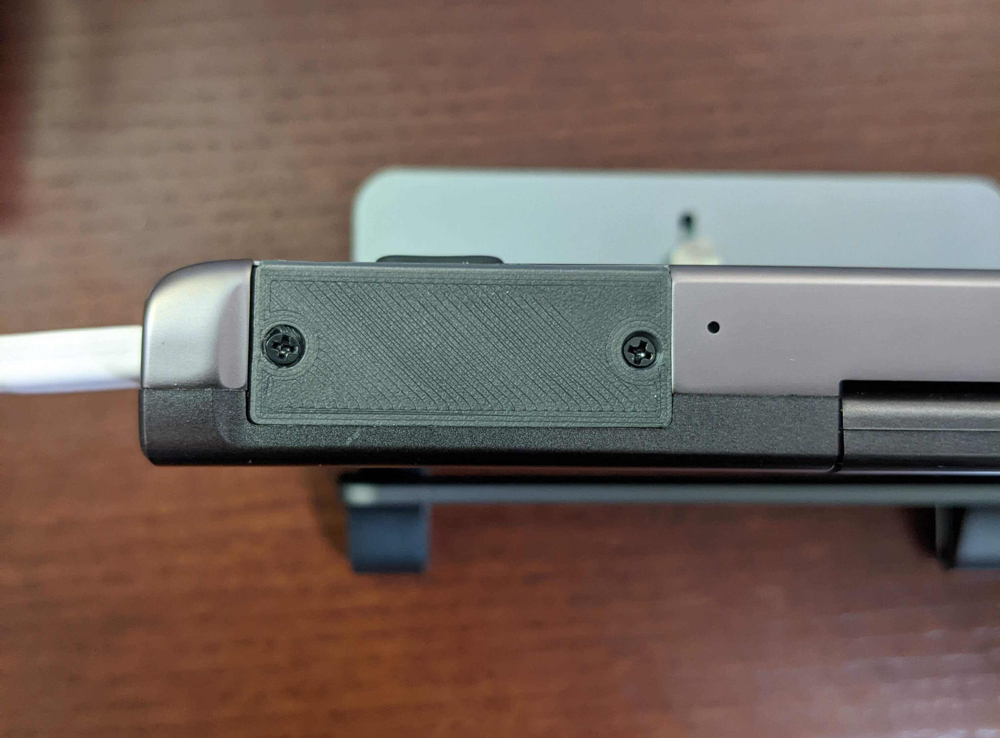
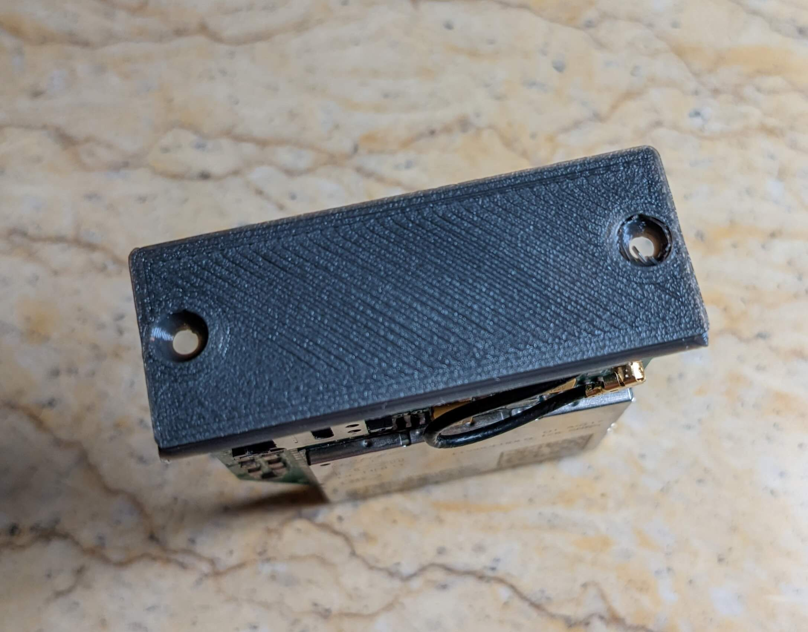
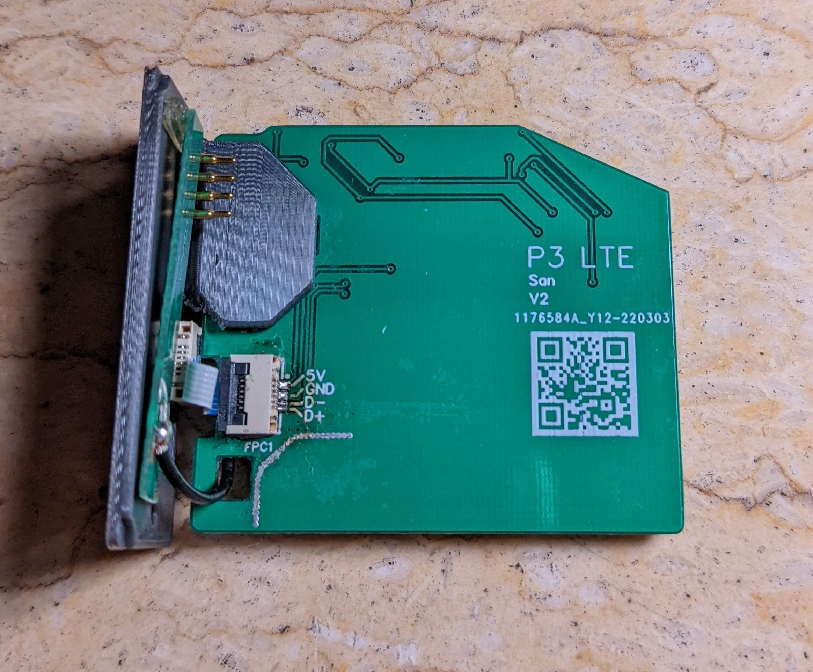
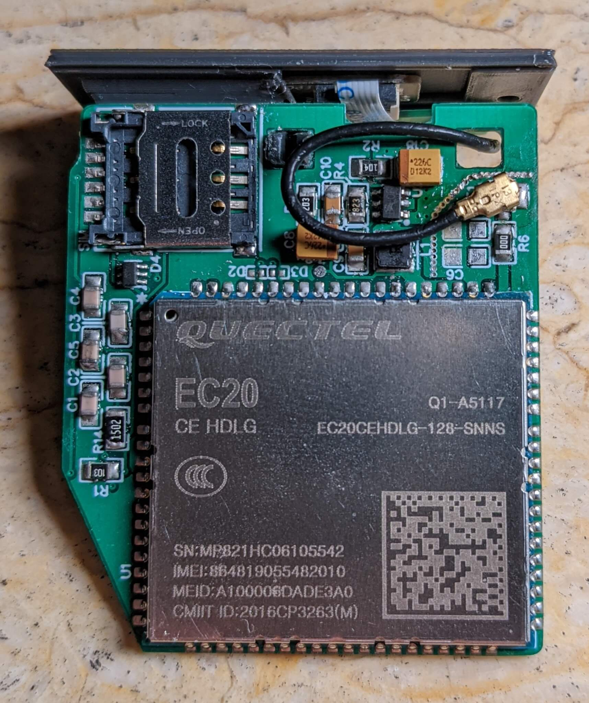

::: slot footer
CC-BY-4.0 @2022 San | <a href="https://beian.miit.gov.cn" target="_blank">沪ICP备18033591号-1</a>
:::

## 简介

P3 LTE 是为 GPD Pocket 3 开发的一款可替换模块。

此模块能为 GPD Pocket 3 提供最高 150Mbps 的 4G 连接速度（理论值）。

## 安装

（此模块仅支持 Windows）

1. 安装模块前请对比下方照片，确保模块本身没有在运输过程中物理性损坏或变形；
2. 安装模块前，请先关机；
3. 将 Nano SIM 卡装入模块中；
4. 拧下原来模块，换上新模块。注意：螺丝虽然尺寸一致，但原厂螺丝是平头，次模块的螺丝是尖头，请不要搞混；
5. 模块安装完后开机，下载并安装 [驱动程序](../hardware/Quectel_LTE&5G_Windows_USB_Driver_V2.2.4.zip)
6. 完成。在 Windows 的设置-网络中，应该就可以看到移动数据连接了。

## 硬件

P3 LTE 使用 __移远通信__ 的 __LTE EC20-CN__ 模块，支持最大下行速率150Mbps 和最大上行速率50Mbps。
[模块官方介绍可点击查看](https://www.quectel.com/cn/product/ec20-cn)

模块使用 USB 2.0 连接，实测待机电流 ~25 mA，数据接受峰值电流 ~240 mA，数据发送峰值电流 ~400 mA。

成品图（可能略有变动）：

外壳采用 3D 打印，模型文件以及 PCB 设计，请访问 [GitHub](https://github.com/zhujunsan/p3-lte) 仓库，查看 hardware 文件夹

## 其他

你如果对其他模块感兴趣，可以查看 [P3-Clicker](https://p3-clicker.wulige.com)

