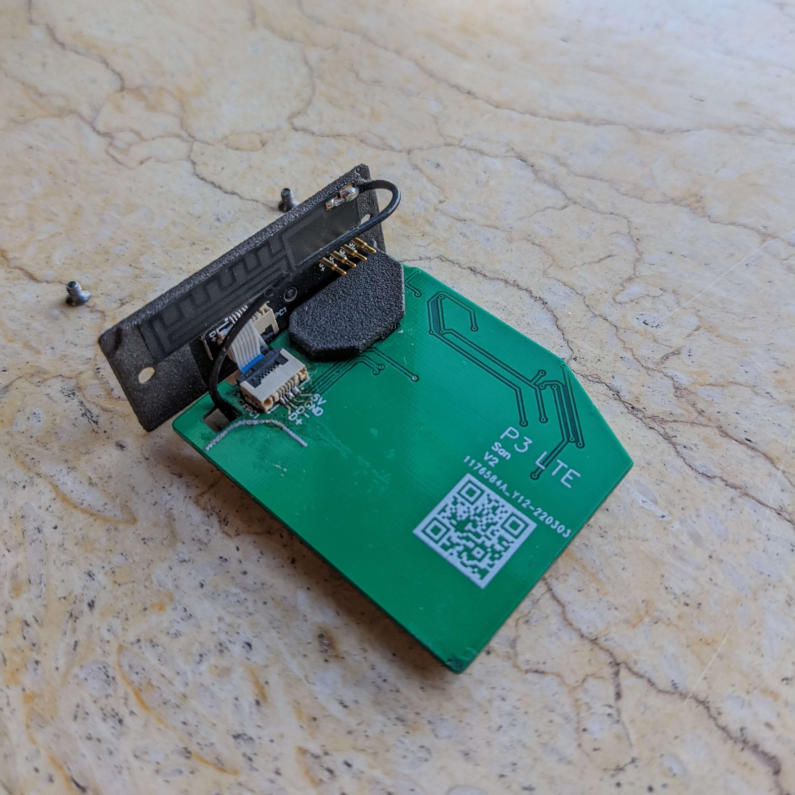
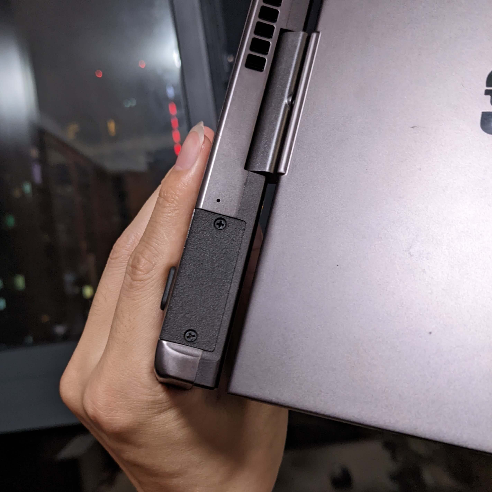

::: slot footer
CC-BY-4.0 @2022 San | <a href="https://beian.miit.gov.cn" target="_blank">沪ICP备18033591号-1</a>
:::

## 简介

P3 LTE 是为 GPD Pocket 3 开发的一款可替换模块。

此模块能为 GPD Pocket 3 提供 移动/联通/电信 2/3/4G 的网络连接。

具体支持的通信模式与速度（理论值）：

| 通信模式               | 速度                                   |
|--------------------|--------------------------------------|
| LTE 速率 (Mbps)      | LTE-FDD: Max. 150 (DL)/ Max. 50 (UL) |
|                    | LTE-TDD: Max. 130 (DL)/ Max. 30 (UL) |
| DC-HSPA+ 速率 (Mbps) | Max. 42 (DL)/ Max. 5.76 (UL)         |
| WCDMA 速率 (Kbps)    | Max. 384 (DL)/ Max. 384 (UL)         |
| TD-SCDMA 速率 (Mbps) | Max. 4.2 (DL)/ Max. 2.2 (UL)         |
| EVDO 速率 (Mbps)     | Max. 3.1 (DL)/ Max. 1.8 (UL)         |
| CDMA2000 速率 (Kbps) | Max. 307.2 (DL)/ Max. 307.2(UL)      |
| EDGE 速率 (Kbps)     | Max. 296 (DL)/ Max. 236.8 (UL)       |
| GPRS 速率 (Kbps)     | Max. 107 (DL)/ Max. 85.6 (UL)        |

## 安装

（此模块仅支持 Windows）

1. 安装模块前请对比下方照片，确保模块本身没有在运输过程中物理性损坏或变形；
2. 安装模块前，请先关机；
3. 将 Nano SIM 卡装入模块中；
4. 拧下原来模块，换上新模块。注意：螺丝虽然尺寸一致，但原厂螺丝是平头，此模块的螺丝是沉头，请不要搞混；
5. 模块安装完后开机，下载并安装 [驱动程序](../hardware/Quectel_LTE&5G_Windows_USB_Driver_V2.2.4.zip)（模块需要通电大约十几秒后才会在设备管理器中可见）；
6. 完成。在 Windows 的设置-网络中，应该就可以看到移动数据连接了。

## 硬件

P3 LTE 使用 __移远通信__ 的 __LTE EC20-CN__ 模块，支持最大下行速率150Mbps 和最大上行速率50Mbps。
[模块官方介绍可点击查看](https://www.quectel.com/cn/product/ec20-cn)

模块使用 USB 2.0 连接，实测待机电流 ~25 mA，数据接收峰值电流 ~240 mA，数据发送峰值电流 ~400 mA。

成品图（可能略有变动）：

Update 20220625: 更换了更合适的天线和外壳

外壳采用 3D 打印，模型文件以及 PCB 设计，请访问 [GitHub](https://github.com/zhujunsan/p3-lte) 仓库，查看 hardware 文件夹

## 其他

你如果对其他模块感兴趣，可以查看 [P3-Clicker](https://p3-clicker.wulige.com)

